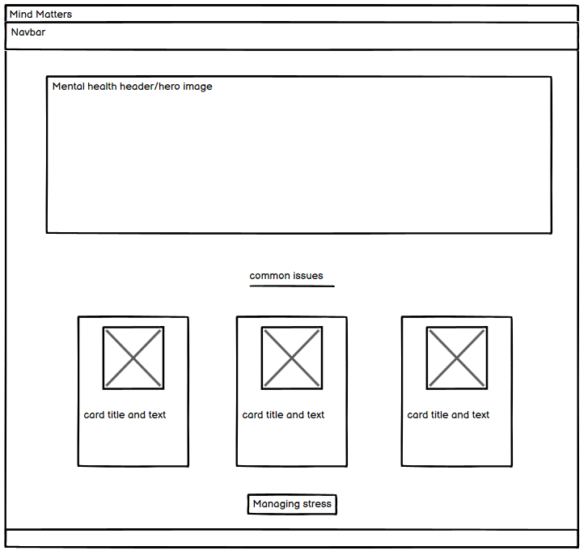
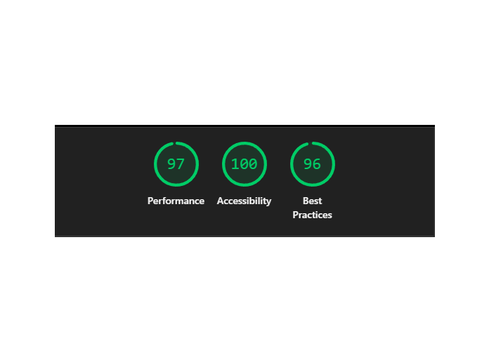

# 
Mind-Matters 

## 
A project for code institute by David Barton 

### 
[Link to the website](https://genericname192.github.io/Mind-Matters/#) 

## Index

1. [Overview](#overview)
2. [UX Design Process](#ux-design-process)
   - [User Stories](#user-stories)
   - [Wireframes](#wireframes)
   - [Color Scheme](#color-scheme)
   - [Fonts](#fonts)
3. [Features](#features)
4. [Improvements](#improvmentsfuture-development)
5. [Deployment](#deployment)
6. [Testing and Validation](#testing-and-validation)
7. [AI implementation](#ai-implementation)
8. [References](#references)
9. [Tech used](#tech-used)
10. [Learning points](#learning-points)

## Overview

Mind Matters is a basic educational website designed to give easy to understand infomation on mental health issues such as depression, anxiety or feelings of isolation. As it stands it does not include much but I want to expand on it to include some strategies for combating these issues.

## UX Design Process

### User Stories

- As a first-time visitor, I want to easily understand what the site is about so that I know it offers mental health support.
- As someone new to mental health topics, I want to read clear, beginner-friendly definitions of common issues so that I can identify what I might be experiencing.
- As a user feeling overwhelmed, I want the site to have a calming design so that I feel safe and supported while reading.
- As someone looking for help, I want to see tips on how to manage stress so that I can try simple strategies right away.
- As a visually-oriented learner, I want to see icons or visuals alongside text so that the information is easier to understand and remember.
- As a mobile user, I want the site to be responsive so that I can read it comfortably on my phone or tablet.

### Wireframes

Moblie view

Tablet view

PC view

This one saw the most change as I decided that 5 on a page was too clutered and also required that the cards be different sizes so in the end I went with 4 on the first line and 2 on the second.

### Color Scheme

I orignally went with what I believe to be a calm and relaxed color scheme due to the nature of the website, however I ran into some issues with wave that ended up changing the color scheme to a much darker one. The color scheme was generated using Chatgpt with some editing from me. If I had more time I would like to revisit the color scheme and find more of a balence between what I was after and accessability.

### Fonts

I just went with some readable fonts that I thought looked nice, I used ChatGpt to quickly view a few different options and went with Quicksand for text and Karla for headings.

## Features

The website as it is doesn't have many features it has some info cards with some definitions of common place mental health issues as well as some tips for dealing with them. There is also some tips on managing day to day stress, a in crisis button that opens a modal signposting to the Samaritans and a form to give feedback. Finally it has a "darkmode" button which just makes the navbar and footer dark green, I did this more just to practise doing that for the future.

## Improvments/Future development

The website as it is is very basic, in an ideal world I would add a backend allowing for content to be updated easier, I would also like to have added a section on mindfullness but due to time restrains I have decided not to. I also like trying to gameify things so maybe add a small game or quiz to allow uses to test the knowledge they gain on the site. I would also like to revisit the color scheme as I am currently unhappy with it.

## Deployment

The website is hosted via Github pages. To host your own website follow these steps:

1. Visit the Github respository of your choice.
2. Click settings along the top of the options bar (the cog icon)
3. Click the pages link on the left hand side - its at the bottom of the Code and automation subheading
4. Under branch click which branch you want to go live with (most likely main) and then click save.
5. Wait afew minutes and then click the link that should appear near the top of the screen and you will see your newly deployed website.
6. You can unpublish at anytime by clicking the three dots icon and clicking Unpublish site

## Testing and Validation

The code was tested at [https://validator.w3.org/#validate_by_input](https://validator.w3.org/#validate_by_input) and [https://jigsaw.w3.org/css-validator/validator](https://jigsaw.w3.org/css-validator/validator)

HTML

I did have some info feedback but I decided to ignore this as it was being caused by an extention I was using.
I have also run the validator on each other page and it has returned with the same.

CSS

JS

Lighthouse

A lot of the issues with the code were from external sources such as bootstrap of font awesome, there were acouple with my code base that I decided to leave as they were, for example I lose some best practise score for low res images however i felt that given the size and the style of the images I was able to get away with them being low res and kept them like that to improve load times.

## AI implementation

I used AI a lot during this project, it was remarkable how easy it was to come up with and test ideas. The main way in which I used AI was during the planning process, it was able to help me name the website, helped me choose a color scheme as well as a font. It was also used to generate a lot of the content of the website. I also found it extremely helpful with code generation and debugging, A link to my conversations with Chatgpt during this project can be found [here](https://chatgpt.com/share/683d7bca-b74c-8003-9439-cf68256709ed)

I feel like AI as it is now let alone how it will be years from now is a bit of a game changer, it massively speeds up the development process, that being said I do feel like the age of software developers is not yet over, AI still comes up with silly ideas and sometimes poorly implements changes causing things to break, an example of this was I asked co-pilot to help me center the cards on my website as I couldn't remember the bootstrap class and co-pilot decided the best way to achieve this was to make a second row for some of the elements to be on which totally ruined the responsiveness of the website. I Think as it stands AI works to augment developers to be able to create content faster but it is not yet at a point were it can replace them.

## References

Google fonts  
https://fonts.google.com/specimen/Quicksand  
https://fonts.google.com/specimen/Karla

Font awesome  
https://fontawesome.com/

Favicon:
https://favicon.io/favicon-generator/  
This favicon was generated using the following font:

- Font Title: Karla
- Font Author: Jonny Pinhorn
- Font Source: https://fonts.gstatic.com/s/karla/v31/qkBIXvYC6trAT55ZBi1ueQVIjQTD-JqqFENLR7fHGw.ttf
- Font License: undefined

Images:  
Chatgpt https://chatgpt.com/  
https://squoosh.app/

Help with code:  
https://stackoverflow.com/questions/19733447/bootstrap-navbar-with-left-center-or-right-aligned-items  
Github Co-Pilot  
https://www.youtube.com/watch?v=_gKEUYarehE&t=46s

Help with read me:  
https://www.markdownguide.org/cheat-sheet/  
https://github.com/dbeckett93/skillified - I used this as a reference for how a readme should look.

## Tech Used

- **HTML5**: For structuring the web pages.
- **CSS3**: For styling the web pages.
- **Bootstrap 5**: For responsive design and pre-built components.
- **Font Awesome**: For social media icons.
- **Git**: For version control.
- **GitHub**: For hosting the repository and for deploying the site.
- **VS Code**: The code editor used for development.
- **GitHub Copilot**: For code generation and debugging

## Learning points

I feel like I learned a lot on this project but the thing I feel I felt the most was to plan more, due to issues my internet connection I was unable to work during the day set aside for planning this task as such I rushed through it and did not give it the time it deserved and I feel like the project would have gone smoother if I had spent a bit more time thinking things through. An example of this would be the wireframes being different to how it ended up, if I had spent more time on them it would have become clear very quickly that 5 on a row was not a good idea, 12 / 5 is not a whole number.
